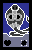

# AnimaCard (CardGame)

  
  
  

## Obs:
ainda não é um jogo jogável pois estou usando para estudar como funciona estrutura de dados no gamemaker.
mas assim que conseguir terminar o sistema de combate deixo uma demo aqui, por enquanto fique a vontade para estudar por aqui :)

